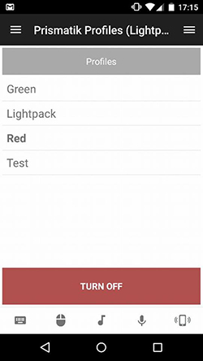
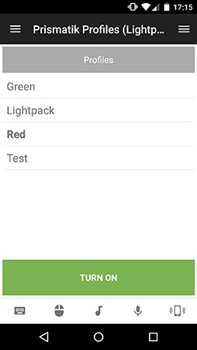

# Prismatik Profiles Remote
Simple remote to control the Prismatik Profiles over TCP.  
Mainly built to annoy coworkers as much as possible. 

## Features
* Get and select light profile for Prismatik
* Turn on/off

## Requirements
 * Prismatik compatible lightset (e.g. LightPack.tv)
 * Prismatik installed (https://github.com/woodenshark/Lightpack/releases)

## Setup
 1. Open Prismatik settings
 2. Go to experimental
 3. Check "Enable server (API via sockets)"

## Todo
 * Improve interface
 * Manually switch colors

## Screenshots

